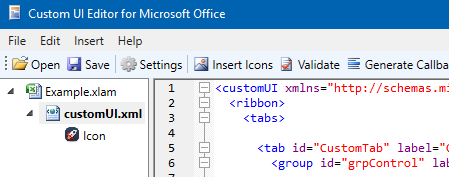

Office RibbonX Editor
=====================

 

This GitHub project is a fork of [Custom UI Editor for Microsoft Office](https://github.com/OfficeDev/office-custom-ui-editor). Built on Windows Forms, the original editor by Microsoft is useful on its own, but it has some limitations. Rather than
trying to address those limitations by performing small contributions to the original project, this repo offers a complete redesign
of the project in Windows Presentation Foundation (WPF).

Features of this overhauled editor include:
- [ScintillaNET](https://github.com/jacobslusser/ScintillaNET) (via [SctintillaNET.WPF](https://github.com/Stumpii/ScintillaNET.WPF/tree/master/ScintillaNET.WPF)) as text editor, with seamless syntax highlighting
- The TreeView allows you to have more than one file open, easily switching between different customUI files (for example,
for copying code from one file to another)
- List of recently opened files showing up on the file menu (thanks to 
[RecentFileList](https://www.codeproject.com/Articles/23731/RecentFileList-a-WPF-MRU))
- A `Reload on Save` option that avoids losing any external changes (for more info, see [the section below](#how-does-the-reload-on-save-option-work))
- Possibility of customizing some aspects of the editor such as font size and color
- Plus all the features of the original Windows Forms project

## Download / Build status

To download the latest release, go to the following link:

https://github.com/fernandreu/office-ribbonx-editor/releases/latest

To download the latest development build instead, go to the Artifacts section on Azure Pipelines:

https://dev.azure.com/fernandreu-public/OfficeRibbonXEditor/_build/latest?definitionId=1&branchName=master

## How does the `Reload on Save` option work?

An Office 2007+ file (`.xlsm`, `.xlam`, `.pptm`, `.docx`, etc.) is nothing more than a `.zip` file with a
custom extension. When the Office RibbonX Editor opens one of those files, it unzips it into a temporary
location first, and then it shows the content from there. To save the file, it will apply any changes to
the unzipped files, and zip everything back to its original location.

The way you would use the original Custom UI Editor is similar to the following:

1.	If the file you want to edit is open in Excel, close it first
2.	Open that file in the Custom UI Editor
3.	Edit the xml files, icons, etc.
4.	Save the file in the Custom UI Editor (and close it if you wish)
5.	Open the file back in Excel, and enjoy the changes you just made

However, **what would happen if you forget Step 1** and Excel has the same file open when you are using the
tool? Your workflow could then look like this instead:

1.	Open that file in the Custom UI Editor
2.	Edit xml files, icons, etc.
3.	You realise you had the file open in Excel, so you close it there first
    - But you also had unsaved changes in Excel, so you save the file before closing it
4.	Save the file in the Custom UI Editor (and close it if you wish)
    -	**Remember:** all this time since Step 1, the Custom UI Editor was looking at a temporary unzipped copy
    of the Excel file that did not include the changes saved in Step 3!
5.	Open the file back in Excel. The changes you made in the Custom UI Editor (Step 2) are there, but the ones
you did in Excel (Step 3) have disappeared

**The `Reload on Save` button adds an extra step to the process as a safety precaution in this scenario.** In
essence, Step 4 will no longer use the temporary unzipped copy of the Excel file that was generated in Step 1,
but will generate a new one instead. As a consequence, any external changes you might have done in the meantime
(i.e. Step 3) will no longer get lost. If you did not make any external changes, the `Reload on Save` button
won’t have any noticeable impact for you.

## Other info

*This section has been partially borrowed from the [original Windows Forms project](https://github.com/OfficeDev/office-custom-ui-editor).*

The Office RibbonX Editor is a standalone tool to edit the Custom UI part of Office open document file format. 
It contains both Office 2007 and Office 2010 custom UI schemas.

The Office 2010 custom UI schema is the latest schema and it's still being used in the latest versions of Office including
Office 2013, Office 2016 and Office 365.

To learn more about how to use these identifiers to customize the Office ribbon, backstage, and context menus visit:
 - [Change the Ribbon in Excel 2007-2016](https://www.rondebruin.nl/win/s2/win001.htm)
 - [Customizing the Office Fluent Ribbon for Developers](https://msdn.microsoft.com/en-us/library/aa338202(v=office.14).aspx)
 - [Introduction to the Office Backstage View for Developers](https://msdn.microsoft.com/en-us/library/ee691833(office.14).aspx)
 - [Office Fluent User Interface Control Identifiers](https://github.com/OfficeDev/office-fluent-ui-command-identifiers)
